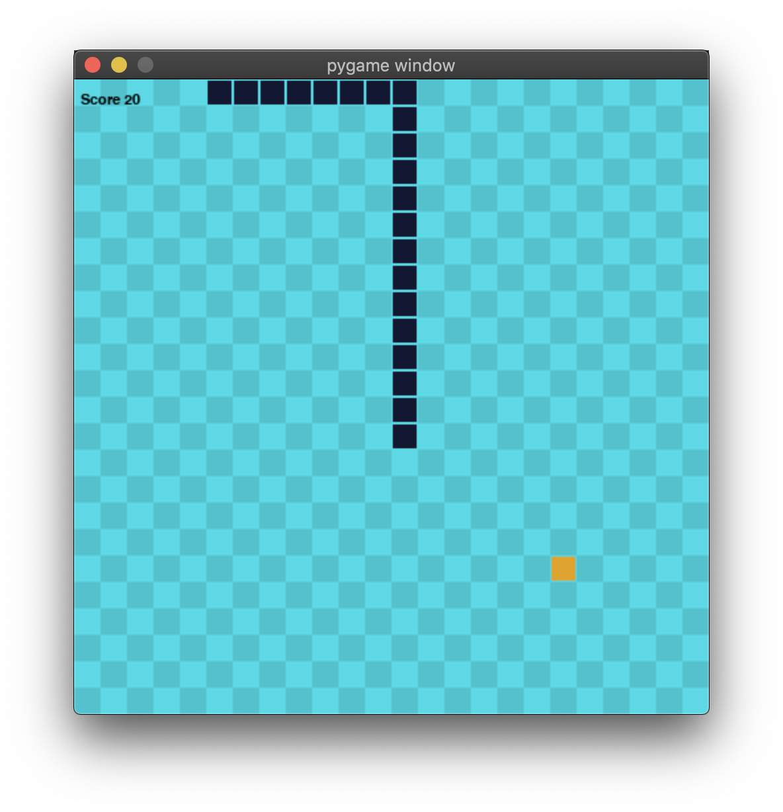

# python-snake-game

A simple snake game created with Python and PyGame

## Table of Contents
* [Description](#-description)
* [Installation](#-installation)
* [Future Development](#-future-development)
* [License](#-license)
* [Resources](#-resources)
* [Questions](#-questions)

## 📝 Description

* survive as long as possible 
* collect food (orange tiles) to increase points 
* each food square is worth one point
* if you run into yourself the game is over
* once the game is over the score is reset to 0

## 💾 Installation
* Install the latest verison of Python. Visit: [Python](https://www.python.org/downloads/) 
* Install the latest verison of PyGame. Visit: [PyGame](https://www.pygame.org/wiki/GettingStarted)
* Once both are installed you can run the game in CLI
* In CLI CD to python-snake-game project
* Run Python3 Script.py 
* Enjoy!

## 🔮 Future Development
* Add Game Sound
* Implement high score 
* Improve style elements 

## 📜 License
**MIT** • *(If you fork and recreate this, please be kind and rebrand your version!)*

## 📚 Resources
* [PyGame](https://www.pygame.org/)
* [Python](https://www.python.org/)
* [Youtube](https://www.youtube.com/watch?v=9bBgyOkoBQ0)

## ❔ Questions?
* **Chase Johnson** 
* **GitHub:** [Chaseyb](https://github.com/Chaseyb)
* <chase.b.johnson@gmail.com>

  
